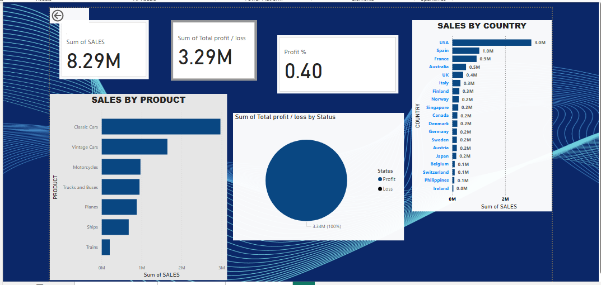
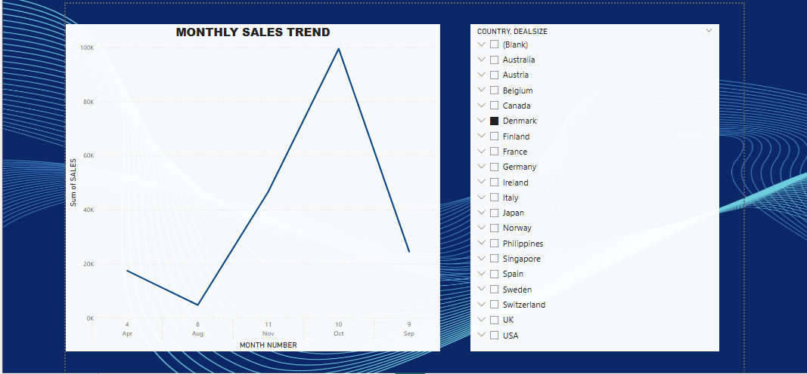

# Data-Analytics-Projects
Data Analytics and Machine Learning projects including Power BI dashboard, customer churn prediction, and Titanic survival prediction.
# 🚀 Data Analytics & Machine Learning Projects

This repository contains projects completed during my internship, focusing on data analysis, visualization, and machine learning.

---

## 📌 Projects Included

### 🔹 Customer Churn Prediction
Predict customer churn using machine learning techniques.

### 🔹 Titanic Survival Prediction
Analyze passenger data and predict survival outcomes.

### 🔹 Sales & Profit Analysis (Power BI)
Interactive dashboard to analyze sales performance and profitability.

---

## 🛠️ Tools & Technologies

- Python
- Pandas
- NumPy
- Scikit-learn
- Power BI

## 📊 Power BI Dashboard

### 🔹 Sales & Profit Overview

---

### 🔹 Monthly Sales Trend

---

💡 This dashboard provides insights into sales performance, profit analysis, and monthly trends to support business decision-making.

### 🔍 Key Insights

- Total Sales: 8M+
- Total Profit: 3M+
- Top performing country: USA
- Sales trend shows seasonal variation

---

## 👩‍💻 Author

Hi, I'm **Ramalakshmi M** 👋  
An aspiring Data Analyst passionate about data visualization and machine learning.

📌 Skills: Python | SQL | Power BI | Pandas | Machine Learning  

